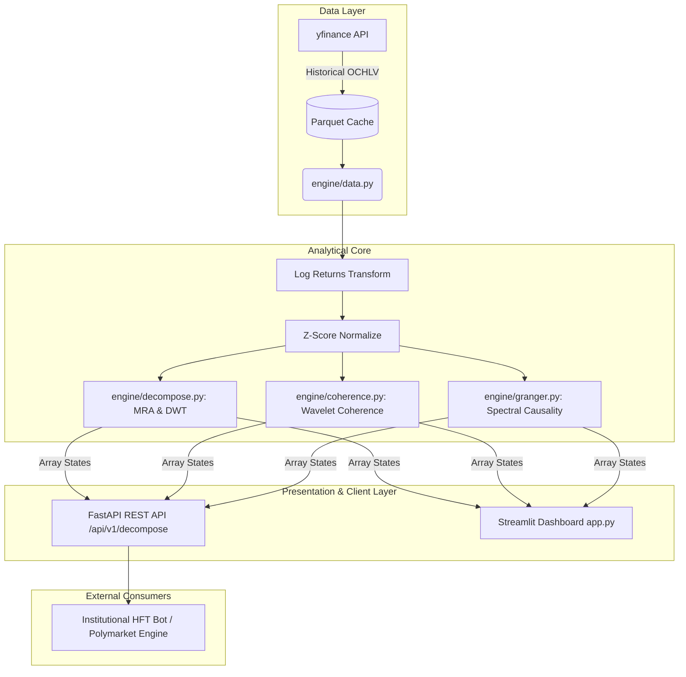

# FinSignal Suite - Systems Architecture & API Integration

This document serves as the high-level system mapping for the FinSignal Suite.

## Core Architectural Flow

The ecosystem is divided into three layers:
1. **Data Ingestion** (`engine/data.py`): Real-time/historical parsing through `yfinance`, backed by a resilient local `.parquet` caching system to ensure low latency and continuous availability during the Hackathon demo.
2. **DSP Analytics Engine** (`engine/`): The mathematical core containing state-of-the-art DSP Python libraries (`PyWavelets` for orthogonal MRA, `ssqueezepy` for Synchrosqueezed CWT, and `pycwt` for spectral cross-metrics). Features custom boundary-condition padding arrays mapped to memory efficiently.
3. **Consumption Interface**: The analytic states are strictly localized and stateless, meaning they seamlessly serve two decoupled clients: The visual Streamlit dashboard, or the raw JSON FastAPI REST backend.

### Decoupled Data Flow Map
Below is the execution state diagram outlining the "Sovereign Ecosystem" data pathways:



## REST API Integration
The newly integrated **FastAPI** layer transforms the DSP engine from a visualization prototype to a competitive, cloud-deployable algorithmic backend.

To launch the API server independently:
```powershell
uvicorn api.main:app --host 0.0.0.0 --port 8000 --reload
```
Consumers can access the interactive Swagger UI payload generator immediately at `http://localhost:8000/docs`. By isolating analytical computation inside FastAPI, we ensure Python's Streamlit execution model does not bottleneck continuous backend tracking.
